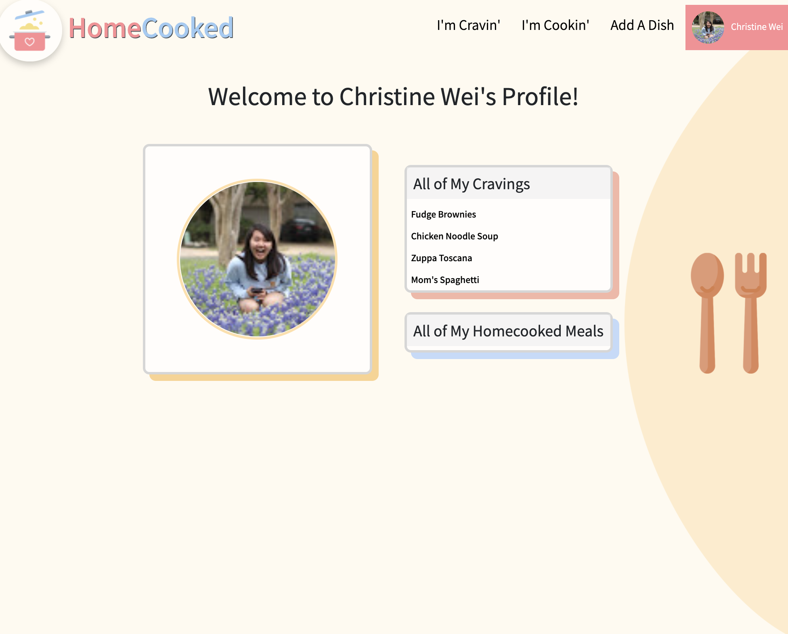

# Project 2: HomeCooked!

There are few things in life as comforting as a home-cooked meal. 

Whether you are missing your parents' simple meals, or looking to share your cooking talents (and earn a little cash on the side), Homecooked is the site for you!

HomeCooked is a web-based application that aims to connect people who share a love for homecooked meals. This application is currently only available on desktop. 

#
# [Visit HomeCooked Here!](https://christinew2-homecooked.herokuapp.com/)

## Getting Started
From the Welcome Page, the user is greeted with two options: 
1. "Explore the Cravings" - brings you to a view of all the dishes that users want to eat.
2. "Check Out the Meals" - brings you to a view of all the dishes that users are able to cook. 

In order to add your own dishes or interact with existing postings, the user will have to log in.

#
## User Features
| Feature            | Description                                                                                                                                |
|--------------------|--------------------------------------------------------------------------------------------------------------------------------------------|
| Add a Dish         | Create a post for a dish you are craving or can cook for others. You have the additional options of adding a description and price range.  |
| Edit this Dish     | Edit the dish you have posted.                                                                                                             |
| Delete this Dish   | Delete the dish you have posted.                                                                                                           |
| Dish Details  | View details about a specific dish. Note: this page contains a scroll functionality.                                                                                               |
| "I Can Cook This!" | Express your interest in cooking a dish that is craved by another user.                                                                    |
| "Let Me Eat This!" | Express your interest in purchasing a dish cooked by another user.                                                                         |
| Commenting         | Post a comment on another dish.                                                                                                            |
| View Profile       | View the profile of yourself or another user; contains a list of all dishes the user has posted.                                           |

Future updates of this application will allow users to safely contact other users who have expressed interest in their dishes.

#
## Features
- MVC architecture
- Full CRUD (Create, Read, Update, Delete) operations
- Google OAuth authentication
#
## Technologies Used
- JavaScript
- HTML
- CSS
- EJS (Embedded JavaScript)
- Node.js
- Express
- MongoDB
- Mongoose
- Google OAuth

#
## IceBox Features
- [ ] Add images to dishes
- [ ] Implement a search bar in Cravings and Cookings views
- [ ] Add sorting functionality
- [ ] Dishes become inactive and eventually deleted past a designated timeframe with no user interaction
- [ ] Notification system for when dishes become inactive 
- [ ] Notification/messaging system to allow users to contact other users who had expressed interest in their dish
- [ ] Ability to save "favorite" profiles
- [ ] Implement Maps API to attach broad user locations to allow users to find dishes nearby
#
### Original Wireframes + Entity Relationship Diagram (ERD)

#
## Attributions
- Icons from www.flaticon.com.
Created by:
  - [photo3idea_studio](https://www.flaticon.com/authors/photo3idea-studio)
  - [Freepik](https://www.freepik.com)
  - [Smashicons](https://smashicons.com)
  - [Pixel perfect](https://icon54.com/)
- Assistant and Source Sans Pro Fonts: [GoogleFonts](https://fonts.google.com/)

